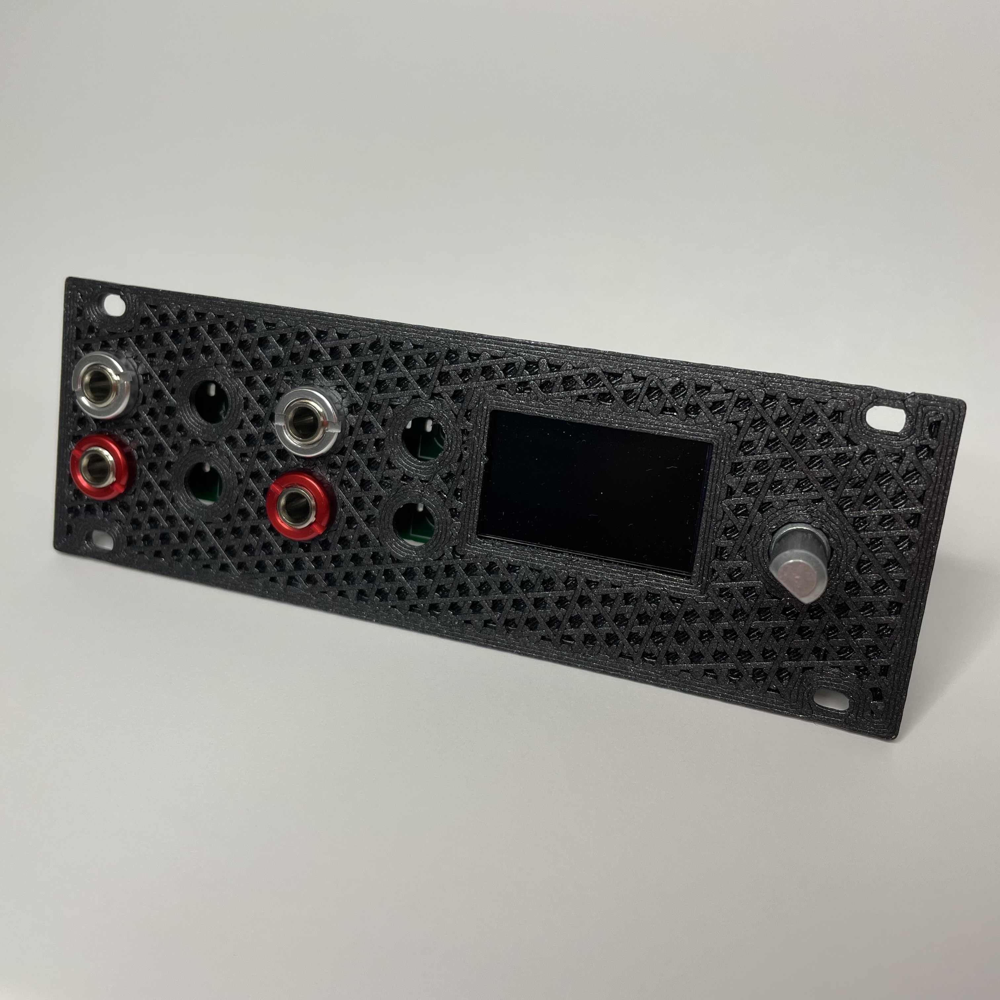
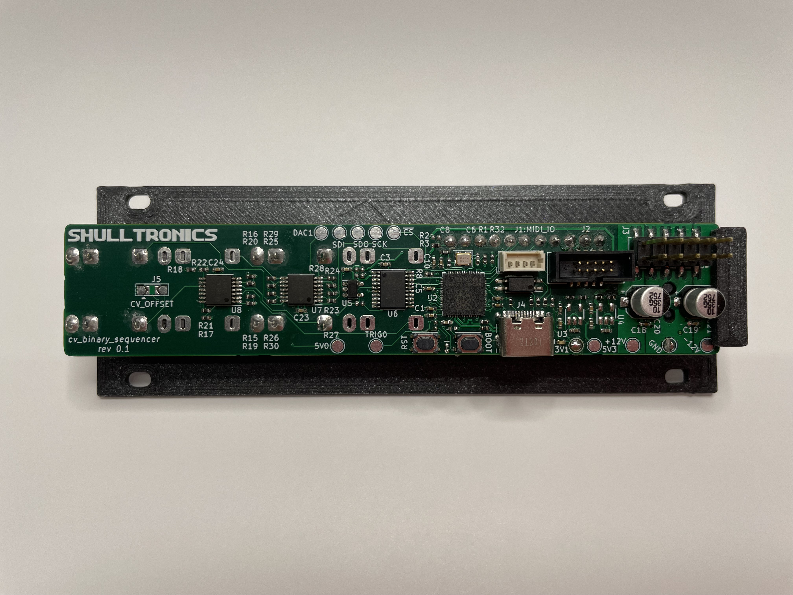

## CV Binary Sequencer

This is a 1U Eurorack module that maps four trigger inputs to four CV outputs.
Inspired by the CV capabilities of Pamela's New Workout, _cv-binary-sequencer_ aims to produce customizable and intricate CV outputs for controlling other modules. There is a mapping of the 16 possible trigger inputs to a combination of CV outputs. On each trigger edge of an input CVs will change to the value specified by the mapping.

_cv-binary-seq_ can be used to multiplex 4 trigger inputs (e.g. 4 pads from a Beatstep Pro, or ) to create 16 different combinations of 4 CV outputs. This could be utilized to create 16 drum sounds from one module, or to create a 16 step melodic sequence that changes pitch, decay rate, and tone on each step.

### Goals
[ ] - Configurable input trigger (rising, falling, etc). 
[ ] - CV outputs similar to PNW (constant value, exponential rise/fall, period wave, etc).
[ ] - Possibly add different input modes (binary mapping input to output, trigger input to cycle through mapping, etc).